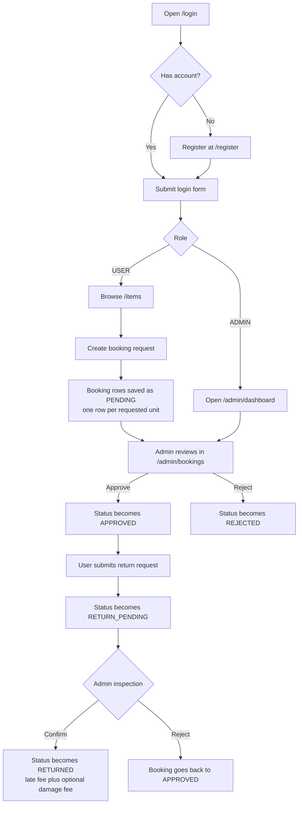
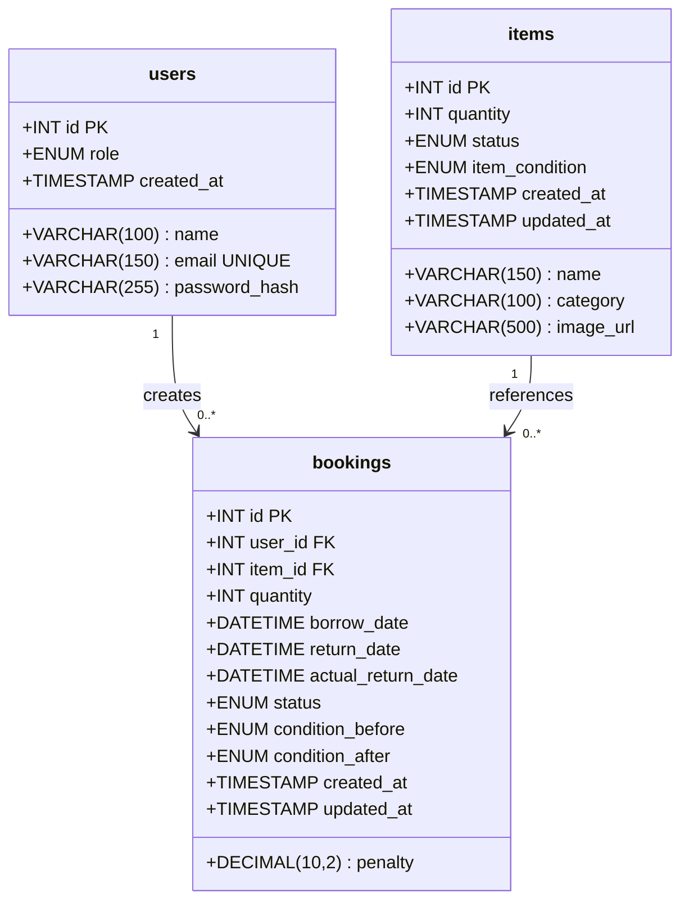

# TrackIT: Smart IT Equipment Inventory System

TrackIT is a Java web application for managing IT equipment requests inside an organization. Regular users can browse the catalogue, submit borrow requests, and request returns. Admins can manage inventory, approve or reject bookings, inspect returns, monitor usage from a dashboard, and export dashboard reports as Excel or PDF files.

## Demo Video

Replace this placeholder after you record your walkthrough:

- Video link: [Project walkthrough placeholder](https://example.com/trackit-demo)
- Suggested video sections:
  - login and seeded accounts
  - catalogue browsing and booking creation
  - admin approval and return confirmation
  - dashboard overview and stock/penalty behavior
  - dashboard export to XLSX and PDF

## Core Features

| Area | What it does |
| --- | --- |
| Authentication | Register new users, log in with BCrypt-hashed passwords, maintain a session, and protect routes with an auth filter |
| Catalogue | Browse, search, and filter equipment by name or category |
| Booking | Create booking requests with a borrow and return datetime window |
| Admin review | Approve or reject requests, confirm or reject return submissions |
| Inventory | Track total units, reserved units, available units, status, and condition |
| Penalties | Apply RM 5.00 per overdue day and optional damage fees during return confirmation |
| Dashboard | Show totals, booking mix, booking trend, category stock, and attention items |
| Reporting | Export a dashboard summary or detailed booking data in XLSX or PDF format for a selected borrow-date range |

## Tech Stack

| Layer | Technology |
| --- | --- |
| Language | Java 17 |
| Web | Jakarta Servlet 6, JSP, JSTL |
| Server | Embedded Tomcat 10 via Cargo Maven plugin |
| Build | Maven |
| Database | MySQL 8+ |
| Authentication | BCrypt |
| Config | dotenv-java |
| Reporting | Apache POI, OpenPDF |
| Frontend | JSP, custom CSS, vanilla JavaScript |

## Prerequisites

- Java 17 or newer
- Maven 3.8 or newer
- MySQL 8 or newer
- `mysql` CLI if you want to import the schema from the terminal

## Project Layout

```text
trackit/
|-- pom.xml
|-- schema.sql
|-- .env.example
|-- README.md
|-- walkthrough.md
`-- src/
    `-- main/
        |-- java/com/trackit/
        |   |-- dao/
        |   |-- filter/
        |   |-- model/
        |   |-- service/
        |   |-- servlet/
        |   `-- util/
        `-- webapp/
            |-- WEB-INF/
            |   `-- views/
            `-- static/
                |-- css/
                |-- js/
                `-- uploads/
```

## Setup and Run

### 1. Clone the project

```bash
git clone https://github.com/techies03/trackit.git
cd trackit
```

### 2. Import the database schema

Open `schema.sql`, copy everything, paste it into MySQL Workbench, and run it.

This creates:

- database: `trackit`
- tables: `users`, `items`, `bookings`
- indexes for booking and category lookups
- seed users and sample items

### 3. Create the `.env` file

Copy `.env.example` to `.env`.

Edit `.env` and set your real database values:

```dotenv
DB_URL=jdbc:mysql://localhost:3306/trackit?useSSL=false&serverTimezone=Asia/Kuala_Lumpur&allowPublicKeyRetrieval=true
DB_USERNAME=root
DB_PASSWORD=your_password
```

Notes:

- `DB_URL` must start with `jdbc:mysql://`
- use port `3306` for MySQL unless your provider gives you a different MySQL port
- keep credentials in `DB_USERNAME` and `DB_PASSWORD`, not inside `DB_URL`

### 4. Build and run the application

```bash
mvn clean package cargo:run
```

Why this command matters:

- `clean` removes the old build output
- `package` compiles the code and creates the WAR
- `cargo:run` starts embedded Tomcat and deploys the WAR at `/trackit`
- Maven will also download dependencies such as Apache POI and OpenPDF automatically the first time you build

### 5. Open the application

Use this URL after the server starts:

```text
http://localhost:8080/trackit/login
```

## Default Seed Accounts

| Role | Email | Password |
| --- | --- | --- |
| Admin | `admin@trackit.com` | `admin123` |
| User | `john@trackit.com` | `admin123` |

## Useful Commands

| Command | Purpose |
| --- | --- |
| `mvn clean package cargo:run` | Full local run with embedded Tomcat |
| `mvn compile` | Download dependencies and compile the app |
| `mvn clean package` | Build the WAR only |
| `mvn -q -DskipTests package` | Fast verification build |
| `mvn clean` | Remove build output in `target/` |
| `mvn dependency:tree` | Inspect dependencies |
| `Ctrl+C` | Stop the running Cargo/Tomcat process |

## Main Routes

| Route | Method | Access | Purpose |
| --- | --- | --- | --- |
| `/login` | GET, POST | Public | Show login form and authenticate |
| `/register` | GET, POST | Public | Create a new `USER` account |
| `/logout` | GET, POST | Authenticated | End the session |
| `/items` | GET | Authenticated | Browse, search, and filter equipment |
| `/items?action=new` | GET | Admin | Show add-item form |
| `/items?action=edit&id=X` | GET | Admin | Show edit-item form |
| `/items` | POST | Admin | Create, update, or delete items |
| `/bookings` | GET | Authenticated user | View own bookings |
| `/bookings?action=new&itemId=X` | GET | Authenticated user | Show booking form |
| `/bookings` | POST | Authenticated user | Create booking or request return |
| `/admin/dashboard` | GET | Admin | Load dashboard cards and charts |
| `/admin/dashboard/export` | GET | Admin | Export dashboard summary or booking data as XLSX or PDF |
| `/admin/bookings` | GET, POST | Admin | Review, filter, approve, reject, or confirm returns |

## Booking Status Model

| Status | Meaning |
| --- | --- |
| `PENDING` | User submitted a request; admin has not decided yet |
| `APPROVED` | Admin approved the request; the unit is reserved |
| `REJECTED` | Admin rejected the request |
| `RETURN_PENDING` | User submitted a return; admin still needs to inspect it |
| `RETURNED` | Admin confirmed the return and finalized the penalty |

## Application Flowchart



## Database UML Diagram

This is a UML-style class diagram of the database entities used by the app.



Notes:

- Booking reference codes such as `BK-0007` are generated in application code from `bookings.id`; they are not stored as a separate database column.
- Reserved stock is also derived in application code from bookings with status `APPROVED` or `RETURN_PENDING`.

## Important Business Rules

- Booking requests cannot start in the past.
- Return datetime cannot be before borrow datetime.
- Requesting quantity `N` creates `N` separate booking rows, each with quantity `1`.
- Overlapping requests count against stock even while still `PENDING`.
- Late fee is RM 5.00 per day based on the submitted return date.
- Damage fee is only allowed when an item was borrowed as `GOOD` and returned as `DAMAGED`.
- If a good unit comes back damaged, usable stock may be reduced instead of freezing the entire item set.
- Dashboard Summary exports use the selected borrow-date range for booking metrics, but inventory figures remain the current stock snapshot at export time.

## Dashboard Export Reports

Admins can export reports directly from the dashboard.

- `Dashboard Summary`: current inventory snapshot, booking totals, status counts, daily booking trend, and category stock summary
- `Booking Data`: detailed booking rows for the selected borrow-date range
- `Formats`: Excel `.xlsx` and PDF `.pdf`
- `Date filter`: both report types filter bookings by borrow date

## Developer Notes

- Run commands from the project root because `DBConnection` reads `.env` from the working directory.
- Uploaded images are stored under `/static/uploads/items/`.
- The embedded Tomcat context path is `/trackit`, configured in `pom.xml`.
- Route protection is centralized in `AuthFilter`.

## Further Reading

See [walkthrough.md](./walkthrough.md) for the architecture walkthrough, class-by-class explanation, function breakdown, and reasoning behind the major flows.

