# 10.0 User Manual

This chapter explains how to use the TrackIT system. It is divided into borrower functions and administrator functions.

## 10.1 User Manual

This section explains how borrowers use the system to sign in, register, browse equipment, submit booking requests, review booking records, and request returns.

### 10.1.1 Login

Use the Login page to access the system with a registered account.

**Figure 10.1:** Login Page

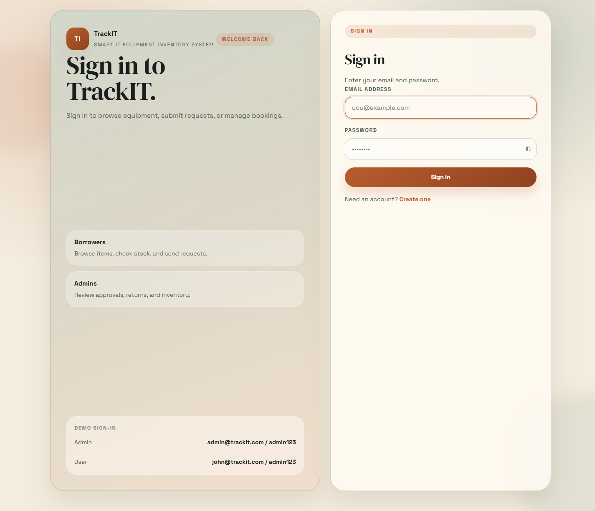

### 10.1.2 Registration

Use the Registration page to create a new borrower account before signing in.

**Figure 10.2:** Registration Page

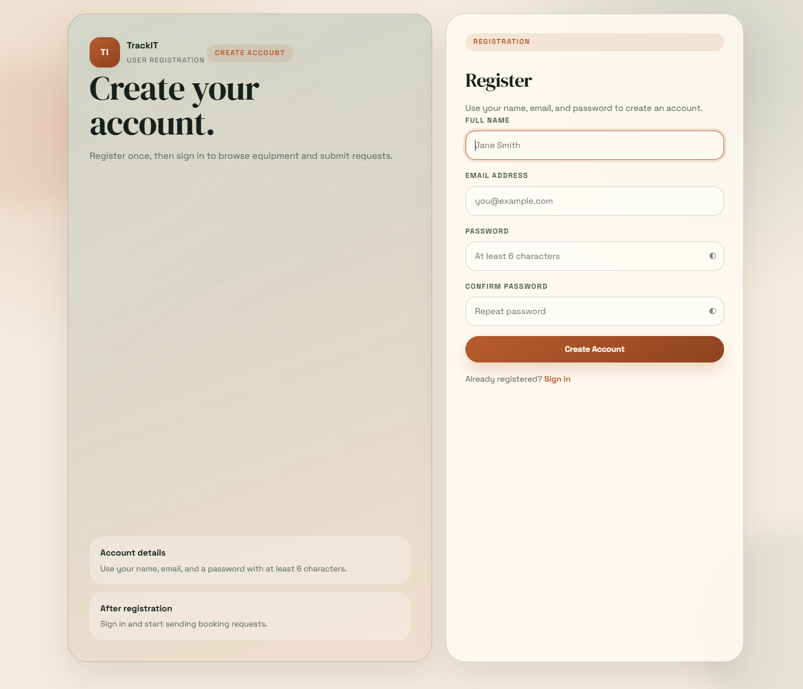

### 10.1.3 Navigation Bar

The navigation bar gives access to the main borrower pages, theme toggle, user profile, and logout control.

**Figure 10.3:** Navigation Bar

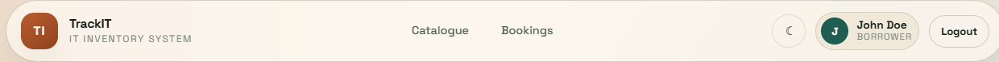

### 10.1.4 Feedback and Notifications

The system uses status badges, toast notifications, and confirmation dialogs to give users immediate feedback.

**Figure 10.4:** Shared Feedback Components

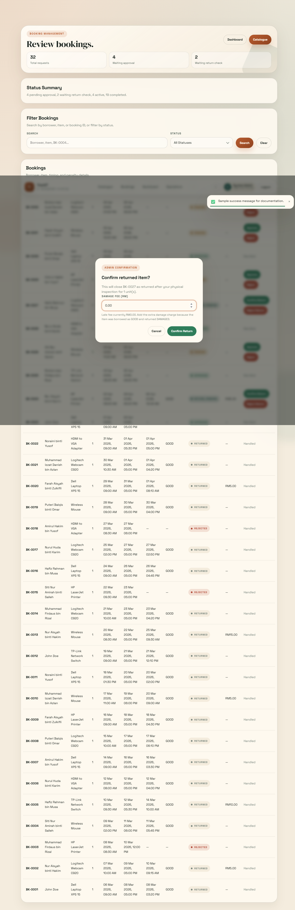

### 10.1.5 Equipment Catalogue

Borrowers use the Equipment Catalogue page to search, filter, and review available equipment before creating a booking request.

**Figure 10.5:** Equipment Catalogue Page

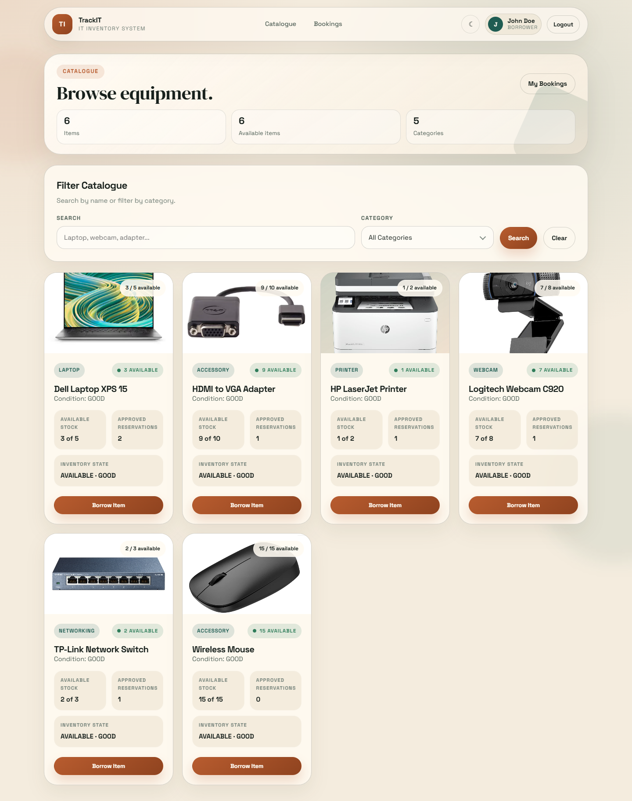

### 10.1.6 Borrow Item

The Borrow Item page is used to choose the booking date, return date, quantity, and observed condition before submitting a request.

**Figure 10.6:** Borrow Form Page

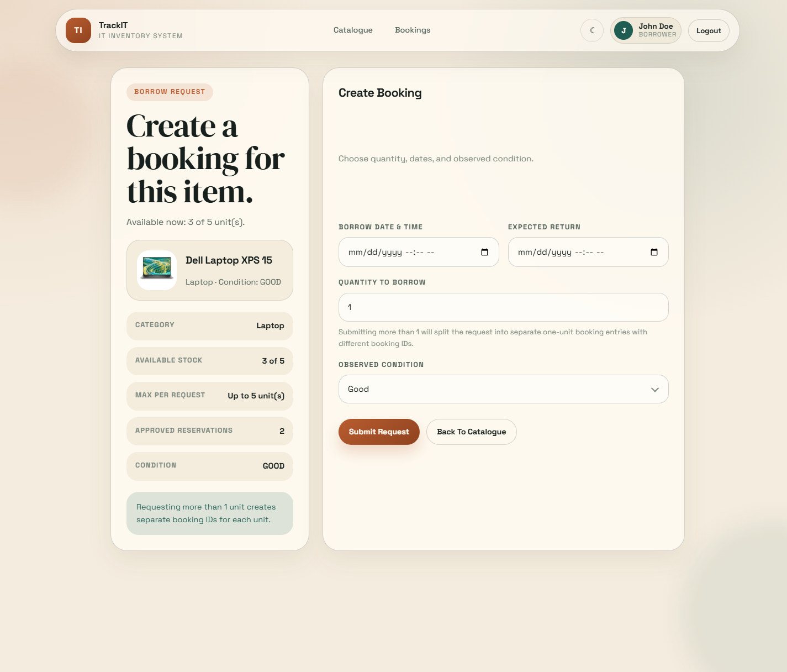

### 10.1.7 My Bookings

The My Bookings page displays all booking records for the current borrower together with booking status and available actions.

**Figure 10.7:** My Bookings Page

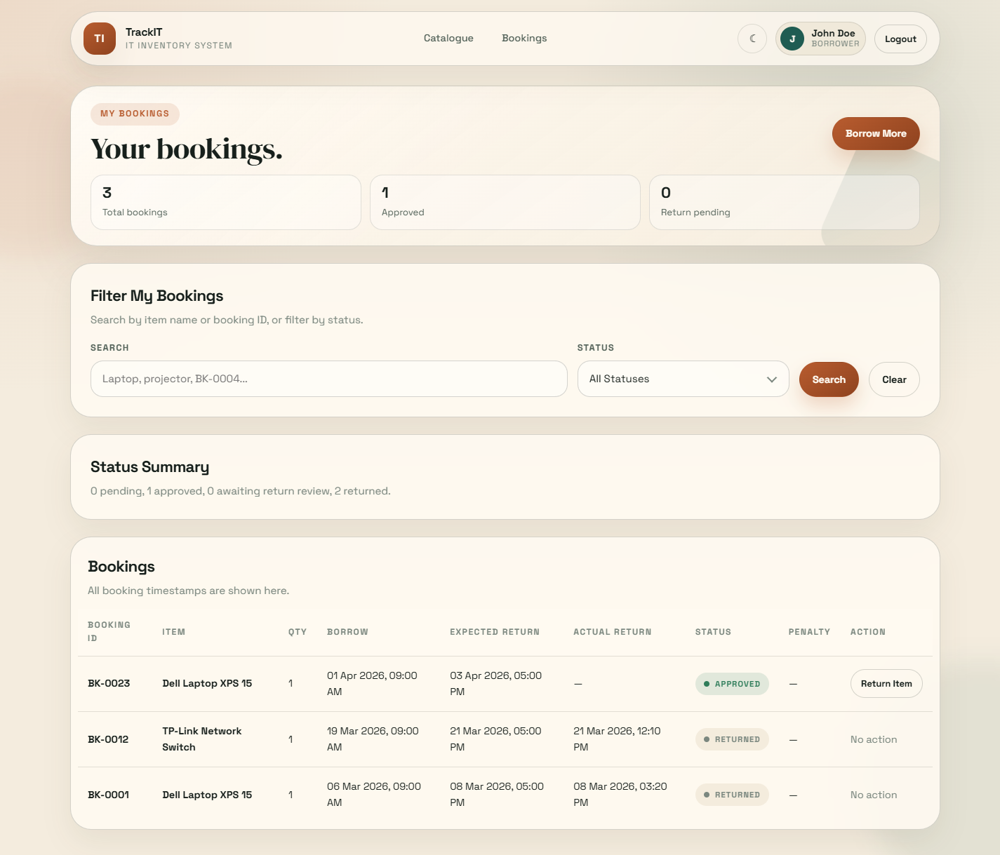

### 10.1.8 Return Request

The Return Request modal is used to submit a return for an approved booking.

**Figure 10.8:** Return Request Modal

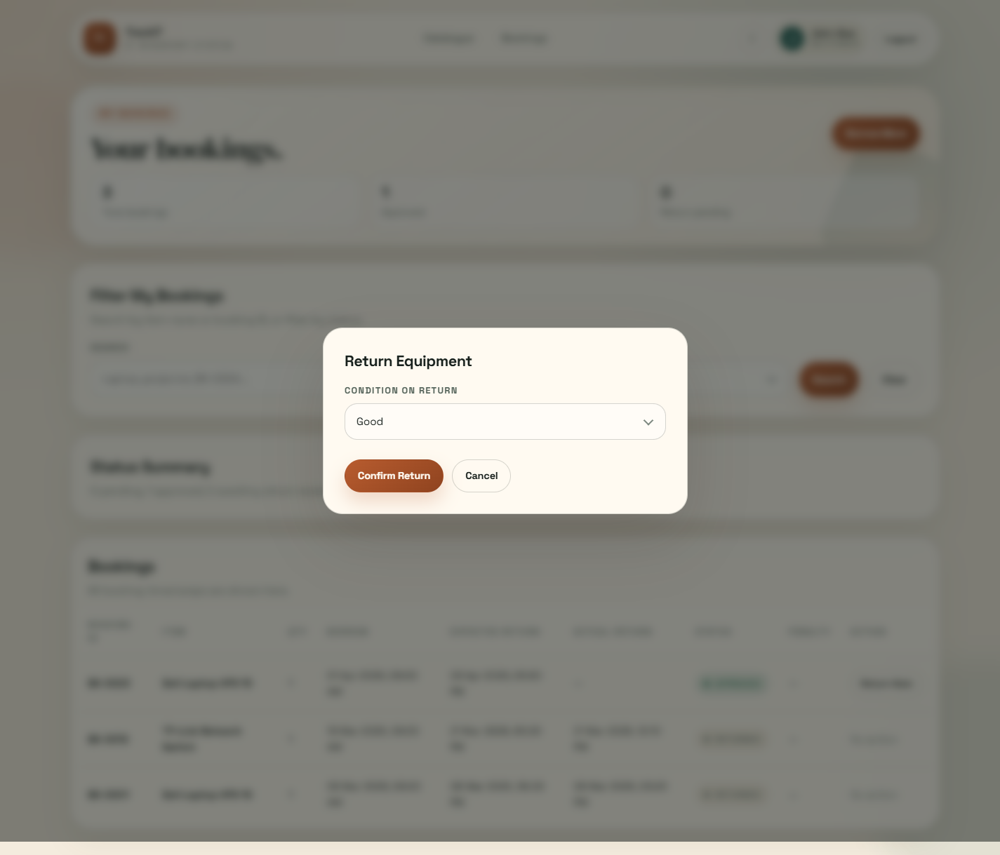

## 10.2 Administrator Manual

This section explains how administrators use the system to monitor activity, manage equipment, review requests, and confirm returns.

### 10.2.1 Administrator Dashboard

The dashboard summarizes booking activity, stock condition, and important actions that require attention.

**Figure 10.9:** Administrator Dashboard

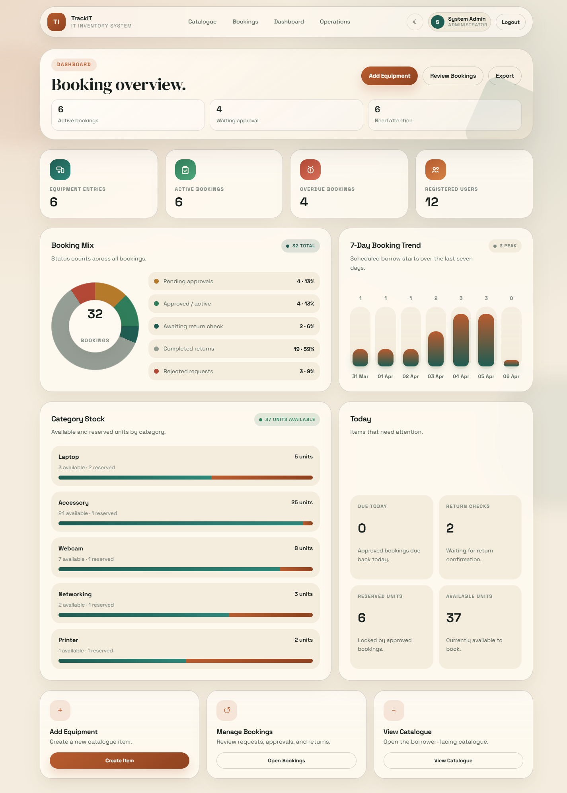

### 10.2.2 Equipment Management

Administrators use the catalogue page to review inventory and access add, edit, or delete actions.

**Figure 10.10:** Item Management Page

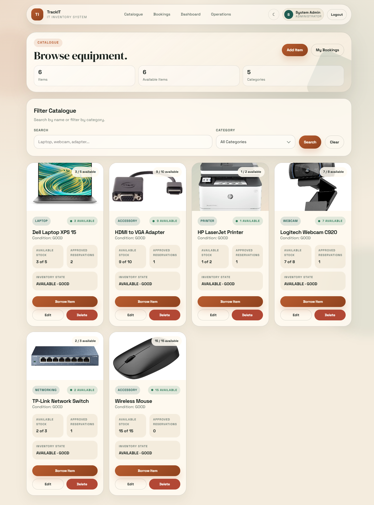

### 10.2.3 Add and Edit Equipment

The Add and Edit Equipment page is used to update item details, upload images, and save equipment changes.

**Figure 10.11:** Add and Edit Equipment Form

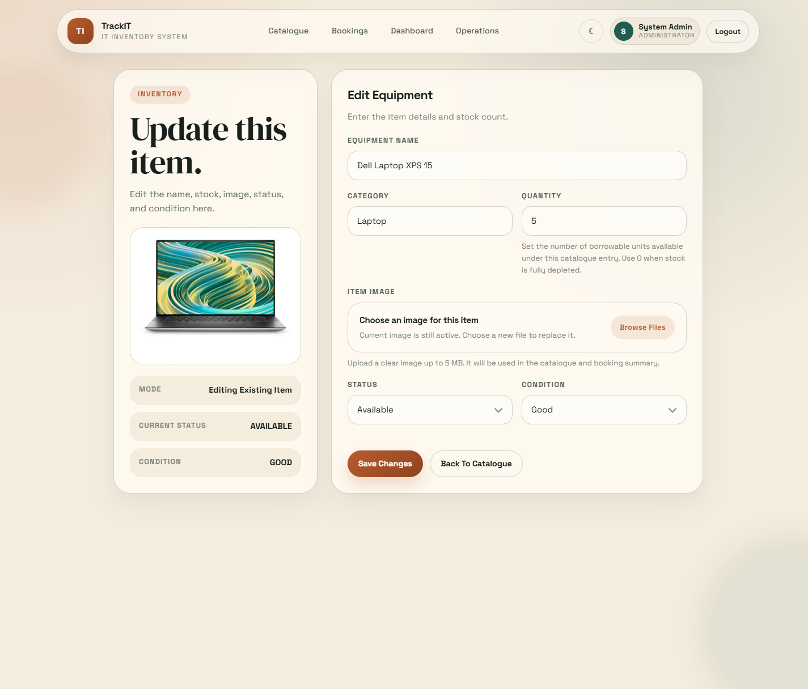

### 10.2.4 Booking Operations

The Booking Operations page is used to approve, reject, and review booking and return requests.

**Figure 10.12:** Booking Operations Page

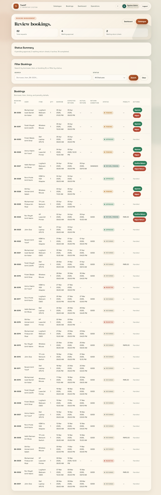

### 10.2.5 Return Confirmation

The Return Confirmation dialog is used by administrators to finalize a return after inspection.

**Figure 10.13:** Return Confirmation Dialog

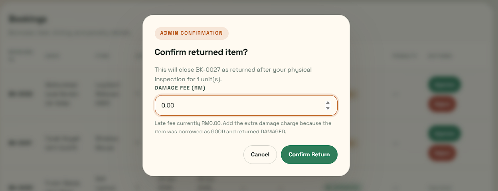
